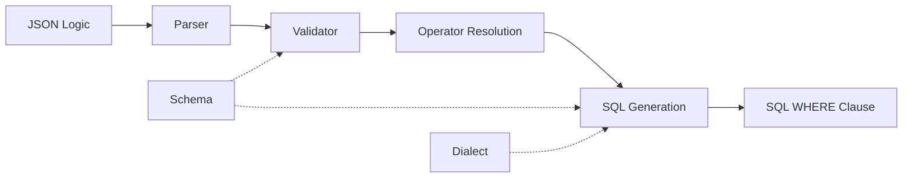

The transpilation process transforms JSON Logic into executable SQL through parsing, validation, operator resolution, and SQL generation.

## Architecture overview

The library uses a multi-stage pipeline:



<Steps>
  <Step title="Parse JSON">
    Convert JSON string to Go data structures
  </Step>
  <Step title="Validate structure">
    Ensure JSON Logic format is correct and operators are supported
  </Step>
  <Step title="Resolve operators">
    Map JSON Logic operators to SQL generators
  </Step>
  <Step title="Generate SQL">
    Produce dialect-specific SQL with proper escaping
  </Step>
</Steps>

## Core components

### Transpiler

The main entry point (`transpiler.go:31-37`) coordinates the entire transpilation process:

```go
type Transpiler struct {
    parser          *parser.Parser
    config          *TranspilerConfig
    operatorConfig  *operators.OperatorConfig
    customOperators *OperatorRegistry
}
```

The transpiler:
- Manages configuration (dialect, schema)
- Delegates parsing to the Parser
- Maintains custom operator registry
- Provides public API methods

### Parser

The parser (`internal/parser/parser.go`) converts JSON Logic structures to SQL:

```go
func (p *Parser) Parse(logic interface{}) (string, error)
```

Key responsibilities:
- Recursive descent through JSON structure
- Type checking and validation
- Operator dispatch
- WHERE clause formatting

### Operator handlers

Each operator category has a dedicated handler (`internal/operators/`):

<Accordion title="LogicalOperator (and, or, !, if)">
  Handles boolean logic and conditional expressions. Manages operator precedence and parenthesization.
  
  ```go
  type LogicalOperator struct {
      config       *OperatorConfig
      comparisonOp *ComparisonOperator
      dataOp       *DataOperator
  }
  ```
</Accordion>

<Accordion title="ComparisonOperator (==, !=, >, <, in)">
  Generates comparison SQL with special handling for NULL values and type coercion.
  
  ```go
  func (c *ComparisonOperator) ToSQL(operator string, args []interface{}) (string, error)
  ```
  
  Features:
  - Automatic NULL → IS NULL conversion
  - Schema-based type coercion
  - Enum value validation
</Accordion>

<Accordion title="ArrayOperator (map, filter, reduce, all, some)">
  Complex array transformations with dialect-specific SQL generation.
  
  ClickHouse gets native functions:
  ```sql
  arrayMap(elem -> elem + 1, numbers)
  ```
  
  Other dialects use UNNEST:
  ```sql
  ARRAY(SELECT (elem + 1) FROM UNNEST(numbers) AS elem)
  ```
</Accordion>

<Accordion title="StringOperator (cat, substr)">
  String manipulation with index conversion (JSON Logic uses 0-based, SQL uses 1-based).
</Accordion>

<Accordion title="DataOperator (var, missing)">
  Variable access and null checks. Handles default values via COALESCE.
</Accordion>

## Transpilation flow

### Basic example

Let's trace how this JSON Logic becomes SQL:

```json
{
  "and": [
    {"==": [{"var": "status"}, "active"]},
    {">": [{"var": "amount"}, 1000]}
  ]
}
```

<Steps>
  <Step title="JSON unmarshaling">
    ```go
    var logic interface{}
    json.Unmarshal([]byte(jsonLogic), &logic)
    // Result: map[string]interface{}{"and": []interface{}{...}}
    ```
  </Step>
  
  <Step title="Parser.Parse()">
    Identifies root operator `and` and extracts arguments array
  </Step>
  
  <Step title="LogicalOperator.handleAnd()">
    Processes each argument recursively:
    - First: `{"==": [{"var": "status"}, "active"]}`
    - Second: `{">": [{"var": "amount"}, 1000]}`
  </Step>
  
  <Step title="ComparisonOperator.ToSQL()">
    For equality: converts `{"var": "status"}` → `status` and `"active"` → `'active'`  
    Result: `status = 'active'`
    
    For greater-than: converts arguments similarly  
    Result: `amount > 1000`
  </Step>
  
  <Step title="SQL composition">
    LogicalOperator joins conditions:  
    ```sql
    WHERE (status = 'active' AND amount > 1000)
    ```
  </Step>
</Steps>

### Complex array example

Array operations demonstrate dialect-specific generation:

```json
{"filter": [{"var": "scores"}, {">": [{"var": "item"}, 70]}]}
```

<Tabs>
  <Tab title="Process">
    1. **ArrayOperator.handleFilter()** receives array and condition
    2. Converts `{"var": "scores"}` to `scores`
    3. Converts condition, replacing `item` with `elem`
    4. Checks dialect from config
    5. Generates appropriate SQL
  </Tab>
  
  <Tab title="BigQuery output">
    ```sql
    WHERE ARRAY(SELECT elem FROM UNNEST(scores) AS elem WHERE elem > 70)
    ```
  </Tab>
  
  <Tab title="ClickHouse output">
    ```sql
    WHERE arrayFilter(elem -> elem > 70, scores)
    ```
  </Tab>
</Tabs>

## Operator configuration

The `OperatorConfig` (`internal/operators/config.go`) provides shared context to all operators:

```go
type OperatorConfig struct {
    dialect Dialect
    Schema  SchemaProvider
}
```

**Why shared config?**
- Operators need dialect information for SQL generation
- Schema validation must be consistent across all operators
- Avoids passing config through every method call

## Schema integration

When a schema is provided, the transpiler performs additional validation and optimization:

### Type validation

```go
func (c *ComparisonOperator) validateOrderingOperand(value interface{}, operator string) error
```

- Ensures fields used in `>`, `<` are numeric/string (not arrays/objects)
- Validates enum values against allowed list
- Prevents invalid comparisons at transpilation time

### Type coercion

```go
func (c *ComparisonOperator) coerceValueForComparison(value interface{}, fieldName string) interface{}
```

If comparing a numeric field to a string literal:
```json
{">": [{"var": "amount"}, "1000"]}
```

The transpiler coerces `"1000"` → `1000` to generate:
```sql
WHERE amount > 1000  -- not amount > '1000'
```

### Schema-aware truthiness

The `!!` operator generates type-appropriate SQL when schema is available:

```go
func (l *LogicalOperator) generateTypeSafeTruthiness(condition, fieldName string) (string, error)
```

| Field type | Generated SQL |
|------------|---------------|
| Boolean | `field IS TRUE` |
| String | `field IS NOT NULL AND field != ''` |
| Numeric | `field IS NOT NULL AND field != 0` |
| Array | `field IS NOT NULL AND CARDINALITY(field) > 0` |

## NULL handling

SQL NULL requires special operators (`IS NULL` instead of `= NULL`). The transpiler automatically converts:

```go
if isRightNull {
    return fmt.Sprintf("%s IS NULL", leftSQL), nil
}
```

**Example:**
```json
{"==": [{"var": "deleted_at"}, null]}
```
```sql
WHERE deleted_at IS NULL  -- not deleted_at = NULL
```

## Error handling

The library uses typed errors (`internal/errors/errors.go`) for clear diagnostics:

```go
type InvalidJSONError struct {
    Err error
}

type UnsupportedOperatorError struct {
    Operator string
}
```

Errors bubble up through the call stack with context:
```
invalid map transformation argument: invalid arithmetic argument 0: field 'x' not found in schema
```

## Performance considerations

### Operator reuse

Operators are created once per transpiler instance and reused across transpilations:

```go
type LogicalOperator struct {
    config       *OperatorConfig  // Shared
    comparisonOp *ComparisonOperator  // Reused
    dataOp       *DataOperator  // Reused
}
```

### Optimized patterns

The `ArrayOperator` detects common reduction patterns:

```go
func (a *ArrayOperator) detectAggregatePattern(expr interface{}) *aggregatePattern
```

Instead of general reduce logic:
```sql
-- General: Iterates through array
(SELECT reducer FROM UNNEST(numbers) AS elem)
```

Optimized for sum/min/max:
```sql
-- Optimized: Single aggregate function
0 + COALESCE((SELECT SUM(elem) FROM UNNEST(numbers) AS elem), 0)
```

## Custom operators

Custom operators integrate into the transpilation pipeline:

```go
transpiler.RegisterOperatorFunc("length", func(op string, args []interface{}) (string, error) {
    if len(args) != 1 {
        return "", fmt.Errorf("length requires 1 argument")
    }
    return fmt.Sprintf("LENGTH(%s)", args[0]), nil
})
```

The parser checks custom operators before built-in operators, allowing overrides (though not recommended for built-ins).

## Variable reference resolution

The `var` operator handles multiple formats:

```go
// Simple field access
{"var": "name"}  → name

// Field with default
{"var": ["status", "pending"]}  → COALESCE(status, 'pending')

// Array index
{"var": 1}  → data[1]

// Current element in array operations
{"var": ""}  → elem
```

Array operations replace element references:

```go
func (a *ArrayOperator) replaceElementReference(condition string) string {
    result := strings.ReplaceAll(condition, "item", "elem")
    result = strings.ReplaceAll(result, "current", "elem")
    return result
}
```

## Composition and nesting

Operators delegate to each other for nested expressions:

```go
func (l *LogicalOperator) expressionToSQL(expr interface{}) (string, error) {
    // ...
    switch operator {
    case "+", "-", "*", "/":
        numericOp := NewNumericOperator(l.config)
        return numericOp.ToSQL(operator, arr)
    case "map", "filter":
        arrayOp := NewArrayOperator(l.config)
        return arrayOp.ToSQL(operator, arr)
    // ...
    }
}
```

This enables arbitrary nesting:
```json
{
  "if": [
    {"all": [{"var": "items"}, {">": [{"var": ""}, 0]}]},
    {"cat": ["Found ", {"var": "count"}, " items"]},
    "No items"
  ]
}
```

## Security

### SQL injection prevention

All literal values are properly escaped:

```go
func (d *DataOperator) valueToSQL(value interface{}) (string, error) {
    switch v := value.(type) {
    case string:
        // Escape single quotes
        escaped := strings.ReplaceAll(v, "'", "''")
        return fmt.Sprintf("'%s'", escaped), nil
    // ...
    }
}
```

Field names are validated (when schema provided) but not escaped - they're identifiers, not data.

### Validation

The validator prevents:
- Unknown operators
- Invalid argument counts
- Type mismatches (with schema)
- Malformed JSON Logic

## See also

<CardGroup cols={2}>
  <Card title="Operators" icon="function" href="/concepts/operators">
    Complete operator reference
  </Card>
  <Card title="SQL dialects" icon="database" href="/concepts/dialects">
    Dialect-specific SQL generation
  </Card>
</CardGroup>